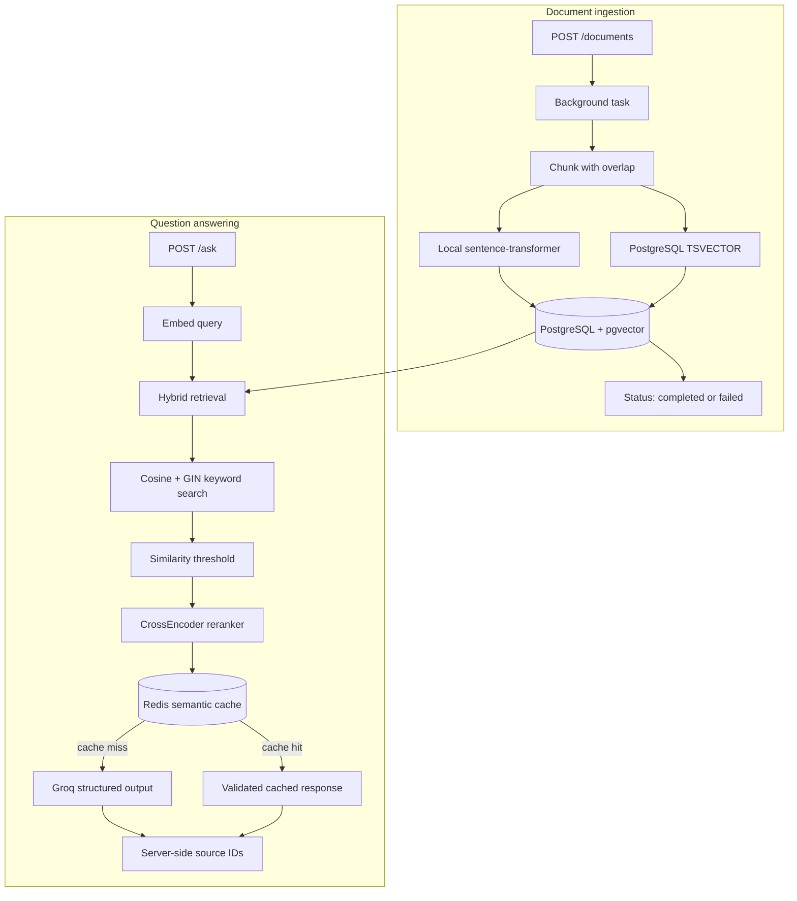

# RAG Knowledge Assistant API

Production-style retrieval-augmented generation backend with vector search, structured outputs, and hallucination guardrails.

[](https://www.python.org/)
[](https://fastapi.tiangolo.com/)
[](https://www.postgresql.org/)
[](LICENSE)

**Stack:** FastAPI · PostgreSQL + pgvector · Redis · sentence-transformers · Groq (OpenAI-compatible) · Pydantic v2 · Docker

## What it does

The API turns tenant-scoped source documents into searchable knowledge and answers questions against that knowledge. Document embedding runs through FastAPI background tasks, so large ingestion jobs leave the HTTP response cycle immediately:

`ingest -> chunk -> embed + full-text vector -> store -> hybrid retrieve -> rerank -> semantic cache or guarded LLM answer`

The design keeps expensive work explicit: ingestion is asynchronous, retrieval combines dense and sparse signals, reranking narrows context before generation, and Redis can bypass repeated LLM inference.



## Features

- Free local embeddings with `all-MiniLM-L6-v2` (384 dimensions; no embedding API cost).
- Hybrid retrieval combining cosine-similarity search in pgvector with PostgreSQL full-text keyword matching.
- Exact keyword matching for entities such as error codes and SKUs alongside semantic retrieval.
- Local CrossEncoder reranking of 15 retrieved candidates before the LLM sees the top 3.
- Similarity-threshold filtering to reject weak context.
- Pydantic-validated JSON responses.
- Explicit hallucination flag for unsupported answers.
- Source document IDs injected server-side, never trusted from the LLM.
- Deterministic `temperature=0` generation.
- Background-task ingestion with a status endpoint for long-running embedding workloads.
- Redis semantic caching with cosine similarity to bypass duplicate LLM calls.
- Tenant-scoped retrieval and cache isolation through `tenant_id`.
- Tenant-scoped document listing, processing, and status checks.
- Persistent ingestion lifecycle states: `pending`, `processing`, `completed`, and `failed`.
- GIN-indexed PostgreSQL `TSVECTOR` search column populated when chunks are ingested.
- Reproducible seeding from official OWASP Cheat Sheet Series Markdown documents, with source and license attribution.

## API reference

| Method | Path | Purpose |
|---|---|---|
| GET | `/health` | Liveness check |
| POST | `/documents` | Store a source document |
| GET | `/documents` | List source documents |
| POST | `/documents/{id}/process` | Queue chunking, embedding, and persistence |
| GET | `/documents/{id}/status` | Check whether processing is `pending`, `processing`, `completed`, or `failed` |
| POST | `/search` | Retrieve hybrid semantic and keyword matches |
| POST | `/ask` | Retrieve context, use the semantic cache, and generate a guarded answer |

Example `/ask` request:

```json
{
  "query": "What is the return policy?"
}
```

Example response:

```json
{
  "answer": "The return policy allows returns within 30 days.",
  "is_hallucination": false,
  "source_document_ids": [7]
}
```

Example `/documents` request:

```json
{
  "title": "Return Policy",
  "content": "Returns are accepted within 30 days.",
  "tenant_id": "acme_corp"
}
```

In the current demo configuration, set `USE_MOCK_TENANT=true` and `MOCK_TENANT_ID=acme_corp` to use one tenant for document creation and retrieval. Otherwise, `tenant_id` from the request is stored for the document, while reads use `MOCK_TENANT_ID` as the active tenant. Production authentication should replace this configuration with the tenant from the request identity.

Example `/search` request:

```json
{
  "query": "ERR-4042",
  "top_k": 3
}
```

## Quickstart

Prerequisites: Python 3.11+ and Docker Desktop.

From PowerShell:

```powershell
docker compose up -d
py -3.11 -m venv fastapi-rag\venv
fastapi-rag\venv\Scripts\Activate.ps1
python -m pip install -r requirements.txt
Copy-Item .env.example fastapi-rag\.env
notepad fastapi-rag\.env
Set-Location fastapi-rag
python -m uvicorn main:app --reload
```

Add `GROQ_API_KEY`, `DATABASE_URL`, and `REDIS_URL` to `fastapi-rag\.env`, then open <http://127.0.0.1:8000/docs>.
For the current single-tenant demo configuration, set `USE_MOCK_TENANT=true` and `MOCK_TENANT_ID=acme_corp`. Redis runs locally at `redis://localhost:6379/0` through Docker Compose.

To seed the database with real public security guidance from the official OWASP Cheat Sheet Series, keep the API running and execute this from the repository root:

```powershell
fastapi-rag\venv\Scripts\python.exe scripts\seed.py
```

The seeder downloads 17 curated OWASP Markdown documents, stores their canonical source URLs and CC BY-SA 4.0 attribution, and waits for each document to reach `completed`. It skips documents whose titles already exist for the active tenant. For a clean disposable database, truncate the document tables before running it again.

To exercise health checks, the full RAG pipeline, semantic caching, hallucination protection, and server-side citations in one run, execute the demo after seeding:

```powershell
fastapi-rag\venv\Scripts\python.exe scripts\demo.py
```

The demo requires the API, PostgreSQL, pgvector, Redis, and `GROQ_API_KEY` to be available. Stage 2 repeats the exact Stage 1 query so the semantic-cache assertion is deterministic. A previous run may already have cached Stage 1, so its label describes the expected pipeline rather than guaranteeing a cache miss.

Run the test suite from the repository root:

```powershell
python -m pip install -r requirements-dev.txt
pytest
```

## Project structure

```text
.
|-- fastapi-rag/
|   |-- main.py         # FastAPI routes and request schemas
|   |-- database.py     # SQLAlchemy engine, sessions, and metadata
|   |-- models.py       # Document and vector chunk models
|   |-- chunking.py     # Overlapping text chunking
|   |-- embeddings.py   # Local sentence-transformer embeddings
|   |-- llm.py          # Groq structured generation and guardrails
|   |-- reranker.py     # Local CrossEncoder relevance reranking
|   |-- semantic_cache.py # Redis vector-similarity response cache
|   `-- .env            # Local secrets; ignored by Git
|-- scripts/
|   |-- seed.py         # Seeds official OWASP source documents through the API
|   `-- demo.py         # Exercises the main RAG features end to end
|-- tests/              # DB- and API-key-free automated tests
|   |-- test_api.py     # FastAPI contract and background-task tests
|   |-- test_chunking.py # Chunk overlap behavior tests
|   `-- test_semantic_cache.py # Cache similarity and tenant-isolation tests
|-- docker-compose.yml  # Persistent pgvector service
|-- requirements.txt    # Runtime dependencies
|-- requirements-dev.txt # Test dependencies
|-- .env.example        # Safe environment template
`-- LICENSE             # MIT license
```

## Design decisions

- **Chunking with overlap:** preserves context across boundaries so a fact split between chunks remains retrievable.
- **Local embeddings:** removes embedding API cost and keeps ingestion data local while retaining a compact 384-dimensional index.
- **Similarity threshold:** prevents unrelated nearest neighbors from being presented as evidence.
- **Server-side source IDs:** makes citations authoritative by deriving them from retrieved database rows instead of model output.
- **Temperature 0:** favors repeatable answers and makes evaluation and debugging easier.
- **Background ingestion:** moves chunking and embedding out of the request/response cycle to prevent long-document HTTP timeouts and keep the API responsive to concurrent requests.
- **Persistent job status:** stores ingestion state on the document row so status remains consistent across workers and process restarts; failures are recorded as `failed`.
- **Hybrid search:** combines dense embeddings for semantic meaning with sparse PostgreSQL full-text matching for exact entities such as `ERR-4042`.
- **Reranking:** expands `/ask` retrieval to 15 candidates, then uses a local CrossEncoder to select the 3 most relevant context chunks for generation.
- **Semantic caching:** stores query embeddings and validated answers in Redis for one hour; a cosine similarity above `0.95` returns the cached answer without calling Groq.
- **Tenant isolation:** uses one resolved tenant ID for retrieval, document listing/status/processing checks, and Redis cache namespaces, preventing cross-tenant results and cache leaks; production authentication should replace the current demo tenant configuration.
- **Full-text indexing:** stores PostgreSQL `TSVECTOR` values on chunks and declares a GIN index so keyword search does not recompute vectors for every row.

## Roadmap

- Next.js chat UI
- Golden evaluation dataset
- Multi-tenant metadata filters
- LangGraph agent mode
- Redis vector index to replace the current tenant-scoped `SCAN` cache lookup at very large cache sizes
- Durable background job queue to replace FastAPI in-process `BackgroundTasks`

## License

MIT. See [LICENSE](LICENSE).