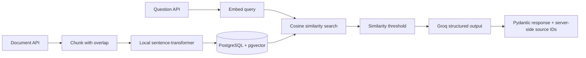

# RAG Knowledge Assistant API

Production-style retrieval-augmented generation backend with vector search, structured outputs, and hallucination guardrails.

**Stack:** FastAPI · PostgreSQL + pgvector · sentence-transformers · Groq (OpenAI-compatible) · Pydantic v2 · Docker

## What it does

The API turns source documents into searchable knowledge and answers questions against that knowledge:

`ingest -> chunk -> embed -> store vectors -> semantic retrieve -> guarded LLM answer with citations`



## Features

- Free local embeddings with `all-MiniLM-L6-v2` (384 dimensions; no embedding API cost).
- Cosine-similarity retrieval in pgvector.
- Similarity-threshold filtering to reject weak context.
- Pydantic-validated JSON responses.
- Explicit hallucination flag for unsupported answers.
- Source document IDs injected server-side, never trusted from the LLM.
- Deterministic `temperature=0` generation.

## API reference

| Method | Path | Purpose |
|---|---|---|
| GET | `/health` | Liveness check |
| POST | `/documents` | Store a source document |
| GET | `/documents` | List source documents |
| POST | `/documents/{id}/process` | Chunk, embed, and persist a document |
| POST | `/search` | Retrieve nearest chunks |
| POST | `/ask` | Retrieve context and generate a guarded answer |

Example `/ask` request:

```json
{
  "query": "What is the return policy?"
}
```

Example response:

```json
{
  "answer": "The return policy allows returns within 30 days.",
  "is_hallucination": false,
  "source_document_ids": [7]
}
```

## Quickstart

Prerequisites: Python 3.11+ and Docker Desktop.

From PowerShell:

```powershell
docker compose up -d
py -3.11 -m venv fastapi-rag\venv
fastapi-rag\venv\Scripts\Activate.ps1
pip install -r requirements.txt
Copy-Item .env.example fastapi-rag\.env
notepad fastapi-rag\.env
Set-Location fastapi-rag
uvicorn main:app --reload
```

Add `GROQ_API_KEY` and `DATABASE_URL` to `fastapi-rag\.env`, then open <http://127.0.0.1:8000/docs>.

Run the test suite from the repository root:

```powershell
pip install -r requirements-dev.txt
pytest
```

## Project structure

```text
.
|-- fastapi-rag/
|   |-- main.py         # FastAPI routes and request schemas
|   |-- database.py     # SQLAlchemy engine, sessions, and metadata
|   |-- models.py       # Document and vector chunk models
|   |-- chunking.py     # Overlapping text chunking
|   |-- embeddings.py   # Local sentence-transformer embeddings
|   |-- llm.py          # Groq structured generation and guardrails
|   `-- .env            # Local secrets; ignored by Git
|-- tests/              # DB- and API-key-free automated tests
|-- docker-compose.yml  # Persistent pgvector service
|-- requirements.txt    # Runtime dependencies
|-- requirements-dev.txt# Test dependencies
|-- .env.example        # Safe environment template
`-- LICENSE             # MIT license
```

## Design decisions

- **Chunking with overlap:** preserves context across boundaries so a fact split between chunks remains retrievable.
- **Local embeddings:** removes embedding API cost and keeps ingestion data local while retaining a compact 384-dimensional index.
- **Similarity threshold:** prevents unrelated nearest neighbors from being presented as evidence.
- **Server-side source IDs:** makes citations authoritative by deriving them from retrieved database rows instead of model output.
- **Temperature 0:** favors repeatable answers and makes evaluation and debugging easier.

## Roadmap

- Next.js chat UI
- Hybrid search (BM25 + vector)
- Reranking
- Golden evaluation dataset
- Multi-tenant metadata filters
- LangGraph agent mode

## License

MIT. See [LICENSE](LICENSE).