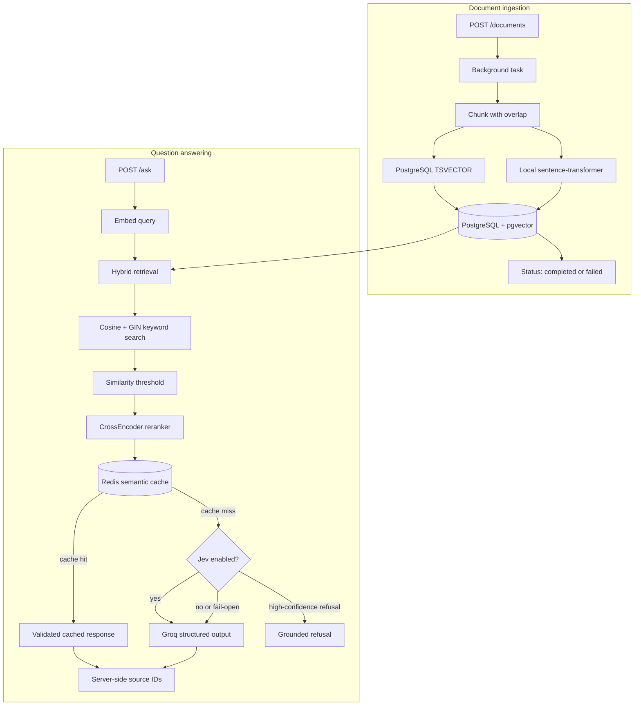

# RAG Knowledge Assistant API

Production-style retrieval-augmented generation backend with vector search, structured outputs, and hallucination guardrails.

[](https://www.python.org/)
[](https://fastapi.tiangolo.com/)
[](https://www.postgresql.org/)
[](https://github.com/pgvector/pgvector)
[](https://redis.io/)
[](https://www.docker.com/)
[](https://docs.pydantic.dev/)
[](https://docs.pytest.org/)
[](https://www.sbert.net/)
[](fastapi-rag/jev_guard.py)
[](https://github.com/Kesarwani17/rag-knowledge-assistant-api/actions/workflows/ci.yml)
[](LICENSE)

**Stack:** FastAPI · PostgreSQL + pgvector · Redis · sentence-transformers · Groq (OpenAI-compatible) · Pydantic v2 · Docker · bcrypt · structlog

This repository is a focused backend reference implementation for grounded question answering: documents are ingested into a tenant-scoped knowledge base, retrieved with both semantic and keyword search, reranked locally, and answered with structured LLM output that carries server-verified citations.

<table>
  <tr>
    <td><strong>Knowledge base</strong><br>Tenant-scoped documents with vector and full-text search</td>
    <td><strong>Grounded answers</strong><br>Structured responses with server-verified citations</td>
    <td><strong>Operations</strong><br>Docker-backed PostgreSQL and Redis services</td>
  </tr>
</table>

> **Pipeline:** ingest, retrieve, rerank, optionally verify with Jev, then generate.
> The Jev guard is disabled by default and fails open when enabled but unavailable.

<table>
  <tr>
    <td><strong>API engineering</strong><br>FastAPI routes, Pydantic schemas, background tasks, and OpenAPI docs</td>
    <td><strong>Search and RAG</strong><br>Hybrid retrieval, pgvector, full-text search, local embeddings, and reranking</td>
    <td><strong>Reliability</strong><br>Tenant isolation, semantic caching, validation, citations, and offline tests</td>
  </tr>
</table>

> **Optional guardrail — Jev System-1:** a typed, confidence-aware answerability check that can refuse out-of-scope questions before LLM generation. It is disabled by default and fails open when enabled but unavailable.

## What it does

The API turns tenant-scoped source documents into searchable knowledge and answers questions against that knowledge. Document embedding runs through FastAPI background tasks, so large ingestion jobs leave the HTTP response cycle immediately:

`ingest -> chunk -> embed + full-text vector -> store -> hybrid retrieve -> rerank -> semantic cache or guarded LLM answer`

The design keeps expensive work explicit: ingestion is asynchronous, retrieval combines dense and sparse signals, reranking narrows context before generation, and Redis can bypass repeated LLM inference.

This project is intentionally built as a learning-oriented reference implementation. The code favors an observable end-to-end flow and explanatory comments so each stage can be followed, tested, and extended before introducing production infrastructure.



## Features

- Free local embeddings with `all-MiniLM-L6-v2` (384 dimensions; no embedding API cost).
- Hybrid retrieval combining cosine-similarity search in pgvector with PostgreSQL full-text keyword matching.
- Exact keyword matching for entities such as error codes and SKUs alongside semantic retrieval.
- Local CrossEncoder reranking of retrieved candidates before the LLM sees the top results (configurable via `RERANK_TOP_K`).
- Configurable similarity-threshold filtering to reject weak context (`SIMILARITY_THRESHOLD`).
- Pydantic-validated JSON responses with explicit request/response models.
- Bounded request inputs at the API boundary (configurable `MAX_REQUEST_SIZE`).
- Explicit hallucination flag for unsupported answers.
- Source document IDs injected server-side, never trusted from the LLM.
- Deterministic `temperature=0` generation.
- Background-task ingestion with a status endpoint for long-running embedding workloads.
- Redis semantic caching with cosine similarity to bypass duplicate LLM calls.
- Optional Jev System-1 answerability guard (feature-flagged, fail-open) refuses out-of-scope queries before LLM generation.
- Tenant-scoped retrieval and cache isolation through `tenant_id`.
- Tenant-scoped document listing, processing, and status checks.
- Persistent ingestion lifecycle states: `pending`, `processing`, `completed`, and `failed`.
- GIN-indexed PostgreSQL `TSVECTOR` search column populated when chunks are ingested.
- Reproducible seeding from official OWASP Cheat Sheet Series Markdown documents, with source and license attribution.
- **Structured JSON logging** via `structlog` with configurable level.
- **Production-ready password hashing** via bcrypt (replaces demo hash).
- **Database connection pooling** configurable via `DB_POOL_SIZE`, `DB_MAX_OVERFLOW`, `DB_POOL_TIMEOUT`.
- **Readiness endpoint** (`/health/ready`) verifying DB, Redis, and Groq connectivity.
- **Configurable retrieval limits** (`RETRIEVE_LIMIT`) and rerank top-K (`RERANK_TOP_K`).

## Request flow

The main question-answering path is intentionally ordered from inexpensive checks to deeper work:

1. Resolve the active tenant and query embedding.
2. Return a sufficiently similar cached answer when available.
3. Retrieve tenant-scoped candidates using pgvector and PostgreSQL full-text search.
4. Reject empty or weak context, then rerank the best candidates locally.
5. Optionally ask Jev whether the top context can answer the question. A high-confidence refusal stops before generation; Jev errors fail open.
6. Generate a Pydantic-validated answer and derive source document IDs from retrieved rows.

The guard is disabled by default, so deployments that leave `USE_JEV` unset retain the original retrieval, cache, and generation behavior.

## API reference

| Method | Path | Purpose |
|---|---|---|
| GET | `/health` | Liveness check |
| GET | `/health/ready` | Readiness check (DB, Redis, Groq) |
| POST | `/documents` | Store a source document |
| GET | `/documents` | List source documents |
| POST | `/documents/{id}/process` | Queue chunking, embedding, and persistence |
| GET | `/documents/{id}/status` | Check whether processing is `pending`, `processing`, `completed`, or `failed` |
| POST | `/search` | Retrieve hybrid semantic and keyword matches |
| POST | `/ask` | Retrieve context, use the semantic cache, and generate a guarded answer |

Example `/ask` request:

```json
{
  "query": "What is the return policy?"
}
```

Example response:

```json
{
  "answer": "The return policy allows returns within 30 days.",
  "is_hallucination": false,
  "source_document_ids": [7]
}
```

Example `/documents` request:

```json
{
  "title": "Return Policy",
  "content": "Returns are accepted within 30 days.",
  "tenant_id": "acme_corp"
}
```

In the current demo configuration, set `USE_MOCK_TENANT=true` and `MOCK_TENANT_ID=acme_corp` to use one tenant for document creation and retrieval. Otherwise, `tenant_id` from the request is stored for the document, while reads use `MOCK_TENANT_ID` as the active tenant. Production authentication should replace this configuration with the tenant from the request identity.

Example `/search` request:

```json
{
  "query": "ERR-4042",
  "top_k": 3
}
```

## Quickstart

Prerequisites: Python 3.11+ and Docker Desktop.

From PowerShell:

```powershell
docker compose up -d
py -3.11 -m venv fastapi-rag\venv
fastapi-rag\venv\Scripts\Activate.ps1
pip install -r requirements.txt
Copy-Item .env.example fastapi-rag\.env
notepad fastapi-rag\.env
Set-Location fastapi-rag
python -m uvicorn main:app --reload
```

Add `GROQ_API_KEY`, `DATABASE_URL`, and `REDIS_URL` to `fastapi-rag\.env`, then open <http://127.0.0.1:8000/docs>.
For the current single-tenant demo configuration, set `USE_MOCK_TENANT=true` and `MOCK_TENANT_ID=acme_corp`. Redis runs locally at `redis://localhost:6379/0` through Docker Compose.

Key environment variables (see `.env.example` for full list):

| Variable | Default | Purpose |
|---|---|---|
| `SIMILARITY_THRESHOLD` | `0.35` | Min cosine similarity for vector results |
| `RERANK_TOP_K` | `3` | Chunks kept after CrossEncoder rerank |
| `RETRIEVE_LIMIT` | `15` | Initial candidates before rerank |
| `DB_POOL_SIZE` | `10` | SQLAlchemy connection pool size |
| `DB_MAX_OVERFLOW` | `20` | Extra connections above pool size |
| `MAX_REQUEST_SIZE` | `1048576` | Max request body (1 MB) |

### Optional Jev configuration

Jev is disabled by default and is designed to fail open. Enable it only when a TypeSafe-compatible endpoint and API key are available:

| Variable | Default | Purpose |
|---|---|---|
| `USE_JEV` | `false` | Enables the answerability check before LLM generation. |
| `JEV_API_KEY` | empty | Bearer token sent to the Jev endpoint. |
| `JEV_API_URL` | `https://api.typesafe.ai/v1/decide` | Jev decision endpoint. |
| `JEV_CONFIDENCE_THRESHOLD` | `0.9` | Minimum refusal confidence required to stop generation. |

The request schema in `fastapi-rag/jev_guard.py` is intentionally isolated because the TypeSafe API contract is still provisional.

To seed the database with real public security guidance from the official OWASP Cheat Sheet Series, keep the API running and execute this from the repository root:

```powershell
fastapi-rag\venv\Scripts\python.exe scripts\seed.py
```

The seeder downloads 17 curated OWASP Markdown documents, stores their canonical source URLs and CC BY-SA 4.0 attribution, and waits for each document to reach `completed`. It skips documents whose titles already exist for the active tenant. For a clean disposable database, truncate the document tables before running it again.

To exercise health checks, the full RAG pipeline, semantic caching, hallucination protection, and server-side citations in one run, execute the demo after seeding:

```powershell
fastapi-rag\venv\Scripts\python.exe scripts\demo.py
```

The demo requires the API, PostgreSQL, pgvector, Redis, and `GROQ_API_KEY` to be available. Stage 2 repeats the exact Stage 1 query so the semantic-cache assertion is deterministic. A previous run may already have cached Stage 1, so its label describes the expected pipeline rather than guaranteeing a cache miss.

Run the test suite from the repository root:

```powershell
pip install -r requirements-dev.txt
pytest
```

## Project structure

```text
.
|-- fastapi-rag/
|   |-- main.py         # FastAPI routes, request schemas, pipeline logic
|   |-- database.py     # SQLAlchemy engine, sessions, metadata, connection pool
|   |-- models.py       # Document, chunk, org, user, token models
|   |-- chunking.py     # Overlapping text chunking
|   |-- embeddings.py   # Local sentence-transformer embeddings
|   |-- llm.py          # Groq structured generation and guardrails
|   |-- reranker.py     # Local CrossEncoder relevance reranking
|   |-- semantic_cache.py # Redis vector-similarity response cache
|   |-- jev_guard.py      # Optional fail-open answerability guard
|   `-- .env            # Local secrets; ignored by Git
|-- scripts/
|   |-- seed.py         # Seeds official OWASP source documents through the API
|   `-- demo.py         # Exercises the main RAG features end to end
|-- tests/              # DB- and API-key-free automated tests
|   |-- test_api.py     # FastAPI contract and background-task tests
|   |-- test_chunking.py # Chunk overlap behavior tests
|   |-- test_semantic_cache.py # Cache similarity and tenant-isolation tests
|   `-- test_jev_guard.py # Offline Jev decision and fail-open tests
|-- docker-compose.yml  # Persistent pgvector service
|-- requirements.txt    # Runtime dependencies
|-- requirements-dev.txt # Test dependencies
|-- .env.example        # Safe environment template
`-- LICENSE             # MIT license
```

## Design decisions

- **Chunking with overlap:** preserves context across boundaries so a fact split between chunks remains retrievable.
- **Local embeddings:** removes embedding API cost and keeps ingestion data local while retaining a compact 384-dimensional index.
- **Similarity threshold:** prevents unrelated nearest neighbors from being presented as evidence.
- **Server-side source IDs:** makes citations authoritative by deriving them from retrieved database rows instead of model output.
- **Temperature 0:** favors repeatable answers and makes evaluation and debugging easier.
- **Background ingestion:** moves chunking and embedding out of the request/response cycle to prevent long-document HTTP timeouts and keep the API responsive to concurrent requests.
- **Persistent job status:** stores ingestion state on the document row so status remains consistent across workers and process restarts; failures are recorded as `failed`.
- **Hybrid search:** combines dense embeddings for semantic meaning with sparse PostgreSQL full-text matching for exact entities such as `ERR-4042`.
- **Reranking:** expands `/ask` retrieval to 15 candidates, then uses a local CrossEncoder to select the 3 most relevant context chunks for generation.
- **Semantic caching:** stores query embeddings and validated answers in Redis for one hour; a cosine similarity above `0.95` returns the cached answer without calling Groq.
- **Tenant isolation:** uses one resolved tenant ID for retrieval, document listing/status/processing checks, and Redis cache namespaces, preventing cross-tenant results and cache leaks; production authentication should replace the current demo tenant configuration.
- **Full-text indexing:** stores PostgreSQL `TSVECTOR` values on chunks and declares a GIN index so keyword search does not recompute vectors for every row.
- **Guard cheap, verify deep:** the optional Jev System-1 guard checks whether the top retrieved context can answer the question before the expensive LLM call; fail-open semantics allow generation to continue when Jev is unavailable or returns malformed data.
- **Operational simplicity:** PostgreSQL and Redis are the only services required by the local stack; embedding and reranking models run in the API process, while Docker provides the stateful dependencies.
- **Explicit API contracts:** Pydantic response models make route outputs visible in generated OpenAPI documentation, while input limits prevent unexpectedly large requests from entering the pipeline.
- **Continuous verification:** GitHub Actions runs the offline test suite on pushes and pull requests.
- **Structured logging:** JSON output via `structlog` enables log aggregation and querying.
- **Secure password storage:** bcrypt via `passlib` replaces the demo hash; `_verify_password` uses constant-time comparison.
- **Connection pooling:** SQLAlchemy pool sizing via env prevents connection exhaustion under load.
- **Readiness probing:** `/health/ready` distinguishes liveness from dependency health for container orchestration.

## Learning scope

The current implementation demonstrates the core RAG pipeline with several production-ready patterns (structured logging, bcrypt, connection pooling, readiness checks, request limits). Authentication uses a token-based demo model; durable background workers, database migrations, distributed tracing, and rate limiting remain as follow-up exercises. Jev is an optional provisional integration with fail-open behavior.

Suggested progression: understand the existing retrieval and generation flow first, then add one production concern at a time, such as authenticated tenant resolution, Alembic migrations, integration tests, retrieval evaluation, or durable job processing.

## Code-reading guide

Follow one question through the system in this order:

1. Start at `fastapi-rag/main.py` and read the `/ask` route.
2. Trace `get_embedding()` into `embeddings.py` to see how the query becomes a vector.
3. Read `retrieve_chunks()` in `main.py` to compare vector search with PostgreSQL full-text search.
4. Follow `rerank_chunks()` into `reranker.py` to see how the top context is selected.
5. Read `semantic_cache.py` to understand how repeated questions can avoid generation.
6. Read `jev_guard.py` to see the optional answerability check and fail-open error handling.
7. Finish in `llm.py` to see structured generation, hallucination signaling, and response validation.

**Production patterns to study:**

- `database.py`: Connection pool config (`pool_size`, `max_overflow`, `pool_pre_ping`)
- `main.py:30-50`: Structured logging setup with `structlog`
- `main.py:75-85`: Bcrypt password hashing and verification
- `main.py:95-115`: Request size limit middleware
- `main.py:117-140`: Readiness endpoint checking DB/Redis/Groq
- `main.py:370-380`: Configurable thresholds via environment variables

Useful learning exercises:

- Change the retrieval limit and observe how the reranker input changes.
- Add a test for a malformed Jev response and verify that the request still proceeds.
- Add a typed response model for one currently dictionary-based endpoint.
- Measure the first `/ask` request against an identical cached request.
- Add one question to an evaluation dataset and verify its expected source document.
- Toggle `SIMILARITY_THRESHOLD` and observe retrieval precision/recall tradeoff.
- Test `/health/ready` with Redis or PostgreSQL stopped.

## Roadmap

- Next.js chat UI
- Golden evaluation dataset
- Multi-tenant metadata filters
- LangGraph agent mode
- Redis vector index to replace the current tenant-scoped `SCAN` cache lookup at very large cache sizes
- Durable background job queue to replace FastAPI in-process `BackgroundTasks`
- Alembic migrations for schema versioning
- Rate limiting middleware
- OpenTelemetry tracing and Prometheus metrics

## License

MIT. See [LICENSE](LICENSE).